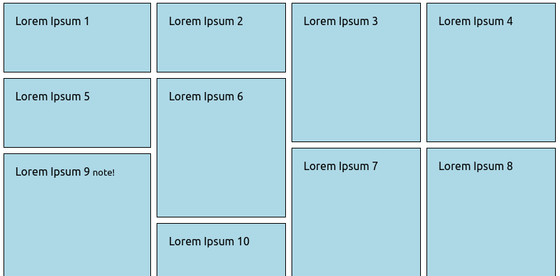

Simple Masonry Layout For Static Site
=====================================

Very simple (yet responsive) implementation of masonry layout, aimed for use on mostly static sites. It splits child elements of container element to separate divs for future css styling. 

It does not count heights or so, just splits items by count and may look pretty awful with certain sets of item heights. 



[DEMO](https://girobusan.github.io/simple-masonry-layout/)

How to
------

### HTML & Java Script


You must have layout container, and a bunch of child elements inside it like this:

```
<div class=".myMasonry">
  <div class="item"> ... </div>
  <div class="item"> ... </div>
  <div class="item"> ... </div>
  <div class="item"> ... </div>
  ...
</div>

```

Include JS somewhere, than call init function like this:

```
  <script src="<path to>/masonry.js"></script>
  <script>
     window.masonry.init( {
        container: ".myMasonry",
        countFn: (container)=>{ return window.innerWidth > 800 ? 4 : 2 }
    } )
    
  </script>

```
Init function parameter is an object with fields:

| name | value | note |
|--|--|--|
| container | CSS selector of container node | Required. Must be unique for your page. |
| children | CSS selector for masonry items | Optional, if not present, will be a concatenation of previous value and `> *` - usually works fine. |
| countFn | Function, which will get a container node as argument, and return the number of columns | Optional, if not present, some* default value will be used |
| bySize | Boolean, set to `true` if you want to use slower, but nicer tiling algorithm | Optional, default = `false`|
| columnClass | Class name for generated column elements | Optional, default = `col` | 

### CSS

After initialization it will add `masonryWatched` class to your container node. It facilitates the creation of fallback styles (see example). You can have regular columns of flex for users without JS, and remove fallback rules for others.

------
\* maybe, 2?

